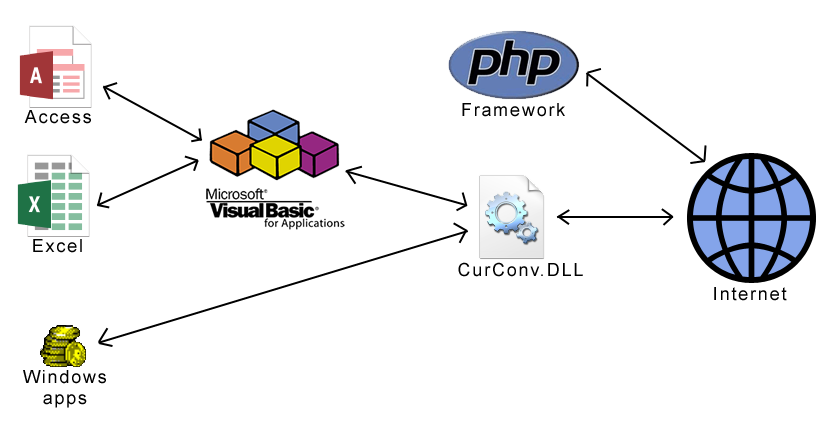
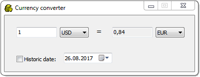

  
## Abstract  
  
ViaThinkSoft Currency Converter is a library developed by [Daniel Marschall](https://www.daniel-marschall.de/) which converts currencies. The latest exchange data is automatically downloaded and cached.  
  
To use ViaThinkSoft Currency Converter, you need an API key from [CurrencyLayer.com](https://www.currencylayer.com/). Keys with limited access are available for free, and there are paid subscriptions available, too.  
  
Usage for online applications, with PHP  
  
[Download framework and example script for PHP](https://github.com/danielmarschall/currency_converter/tree/master/PHP)  
  
[Try it now! Use the online tool](https://www.viathinksoft.com/info/currencyconverter/online_demo/)  
  
## For Windows users
  
If you are not a developer, you can download the ready-to-use demo EXE file.  
  
[Download Windows demo application, written in Delphi](https://www.viathinksoft.de/download.php?id=194)  
  
  
  
## For Windows developers
  
The Currency Converter is implemented as a Windows DLL ([Source code for Delphi](https://github.com/danielmarschall/currency_converter/tree/master/DLL)), which can be used by most other programming languages as well as VBA (Visual Basic for Applications). Therefore, you can use Currency Calculator in Microsoft Office products.  
  
[Download compiled DLL for Win32 and Win64](https://www.viathinksoft.de/download.php?id=194)  
  
Download source code for usage in ...  

-   [VBA (Microsoft Access, Excel etc.)](https://github.com/danielmarschall/currency_converter/tree/master/DLL%20Usage%20Demo/VBA)  
    
-   [C++](https://github.com/danielmarschall/currency_converter/tree/master/DLL%20Usage%20Demo/C%2B%2B)  
    
-   [Delphi](https://github.com/danielmarschall/currency_converter/tree/master/DLL%20Usage%20Demo/Delphi)  
    
Before using the DLL, please place the API key in your registry:

    Windows Registry Editor Version 5.00  
      
    [HKEY_CURRENT_USER\Software\ViaThinkSoft\CurrencyConverter]  
    "APIKey"="....."

[Specification of the exported DLL methods](https://htmlpreview.github.io/?https://raw.githubusercontent.com/danielmarschall/currency_converter/master/DLL%20Specification.html)